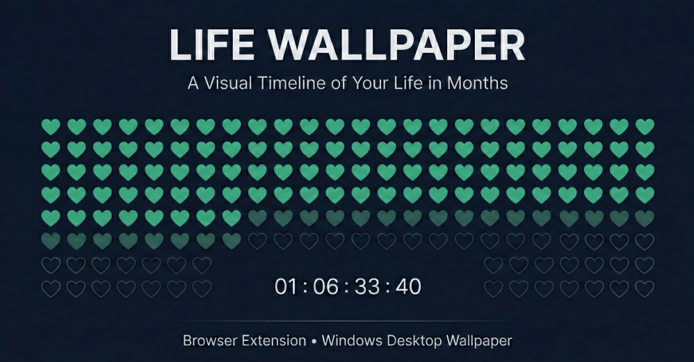

# Life Wallpaper ⏳

A high-performance, privacy-focused life timeline and countdown tracker built to visualize your journey in months across your browser and desktop.

---

## 📖 Overview

**What the project does:** Life Wallpaper provides a reflective perspective on time by mapping out your entire life expectancy in a highly optimized HTML5 Canvas grid. It categorizes your life into past, present, and future months, accompanied by a high-precision countdown timer.

**Why it exists:** Designed as a daily visual reminder of the finite nature of time, this tool encourages focus, gratitude, and intentional living by keeping your most valuable asset—time—in clear view.

**Who it is for:** Productivity enthusiasts, developers, and anyone seeking a minimalist, motivating, and stoic-inspired dashboard for their daily workflow or desktop environment.

---

## ✨ Core Features

- **Dynamic Life Timeline:** Visualizes your entire life expectancy in a responsive grid of months, adapting intelligently to any screen resolution.
- **High-Performance Rendering:** Utilizes a decoupled HTML5 Canvas engine for smooth, low-overhead visualization of thousands of life-month units, bypassing the React component lifecycle to guarantee 60fps+ performance.
- **Real-Time Temporal Engine:** A central high-precision countdown timer calculating your exact life progress down to the millisecond.
- **Indestructible Data Logic:** Features centralized error boundaries and glassmorphism-style warning banners that intercept corrupted data, ensuring the rendering engine never crashes.
- **Highly Personalized:** Customize your Date of Birth (DOB), Life Expectancy, daily focus message, and visual cell shapes (Square, Circle, or Heart).
- **Adaptive Aesthetics:** Full support for Light, Dark, and System Auto themes built on Tailwind CSS.

---

## 🌓 Dual Use Explanation

This application is uniquely engineered from a single codebase to operate natively in two distinct environments.

### Use Case 1: Browser New Tab Extension (Chrome, Brave, Edge)

The application acts as a replacement for your browser's default new tab page. In this mode, it relies on strict HTML5 form validation (`<input type="date">`) and standard browser `localStorage` to persist your configuration. It utilizes absolute pathing (`/`) for asset resolution and natively supports dynamic OS-level theme switching.

### Use Case 2: Windows Desktop Wallpaper (Lively Wallpaper)

The application runs natively on the Windows desktop via the Lively Wallpaper WebView2 engine. It integrates with Lively's C# API via a global `window.livelyPropertyListener` hook, allowing users to configure the wallpaper directly from native Windows UI menus generated by the `LivelyProperties.json` file.

### Architectural Support for Dual Modes

The Vite build process is environment-aware. It dynamically switches asset base paths (`./` for Lively's local file protocol, `/` for the browser extension) based on the target build script. The React `App.tsx` controller acts as an environment adapter, applying strict data validation and conditionally rendering specific UI elements (like the glassmorphism error banner) only when the app detects it is running inside the Lively desktop engine.

---

## ⚠️ Known Limitations

**Lively Wallpaper & System Theme:** The "System Auto" theme mode is fully supported in the Browser Extension but is intentionally disabled in the Lively Wallpaper build. Lively's background embedded web engine runs in an isolated state and does not currently receive live Windows OS theme-change broadcasts. To prevent a broken UX, Lively users must manually toggle between Light and Dark modes via the Lively Customize menu.

---

## 🛠️ Tech Stack

| Layer | Technology |
|---|---|
| Frontend | React 19, HTML5 Canvas API |
| Backend | None (100% Client-Side / LocalStorage) |
| Styling | Tailwind CSS 4 |
| Language | TypeScript |
| Bundler | Vite 7 |
| Runtime | Chromium-based Browsers, Lively Wallpaper (CefSharp / WebView2) |

---

## 📂 Project Structure

```
life-wallpaper/
├── public/
│   ├── icon128.png               # Extension icon
│   ├── LivelyInfo.json           # Lively Wallpaper metadata (AppVersion, Title, etc.)
|   |── thumbnailForLively.png    # Thumbnail for Lively Wallpaper
│   ├── LivelyProperties.json     # Lively native UI configuration mapping
│   └── manifest.json             # Chromium Extension Manifest V3
|
├── assets/
|   ├── social_preview.png        # Repository social preview (used for GitHub Open Graph + README hero) 
|   
├── src/
│   ├── components/
│   │   ├── CountdownTimer.tsx    # High-precision timer component
│   │   ├── LifeCanvas.tsx        # Imperative HTML5 Canvas rendering engine
│   │   ├── PersonalMessage.tsx   # User focus text component
│   │   └── SettingsOverlay.tsx   # React configuration menu for browser extension
│   ├── config/
│   │   └── life.config.ts        # LocalStorage persistence logic
│   ├── types/
│   │   └── life.types.ts         # TypeScript interfaces and global declarations
│   ├── utils/
│   │   ├── life.render.ts        # Transformation logic for render configs
│   │   └── life.time.ts          # Temporal math and date derivations
│   ├── App.tsx                   # Master controller and environment adapter
│   └── main.tsx                  # React DOM entry point
├── index.html                    # HTML template
├── package.json                  # Dependencies and build scripts
└── vite.config.ts                # Vite build configuration (dynamic base paths)
```

---

## 🚀 Installation Guide

### Prerequisites

- Node.js (v18 or higher recommended)
- pnpm (or npm/yarn)
- A Chromium-based browser **OR** Lively Wallpaper (for Windows)

### 1. Clone the repository

```bash
git clone https://github.com/your-username/life-wallpaper.git
cd life-wallpaper
```

### 2. Install dependencies

```bash
pnpm install
```

### 3. Build & Run: Browser Extension Mode

Build the project using the command:

```bash
pnpm run build:ext
```

1. Open your browser and navigate to the extensions page (e.g., `chrome://extensions`).
2. Toggle **Developer mode** on.
3. Click **Load unpacked** and select the generated `dist/` folder.
4. Open a new tab to view the dashboard.

### 4. Build & Run: Lively Wallpaper Mode

Build the project using the Lively-specific environment command:

```bash
pnpm run build:lively
```

1. Open the newly generated `dist/` directory in your file explorer.
2. Select contents **inside** the folder ( `assets/`, `index.html` ,`LivelyInfo.json`, `LivelyProperties.json` and `thumbnailForLively.png`), right-click, and compress them into a `.zip` archive. *(Do not zip the `dist` folder itself.)*
3. Open the **Lively Wallpaper** application on Windows.
4. Click on Add Wallpaper (➕ icon).
5. Drag and drop or choose the `.zip` file from file explorer into the Lively window.
6. Click Ok.
7. Right-click the newly added wallpaper and select **Customize** to open the native settings menu.
8. Provide DOB (YYYY-MM-DD), expectancy (in years), personal message, select from light/dark mode and choose the shape.
9. Hit Ok.

DO NOT FORGET TO ADD LIVELY TO START UP APPS IN TASK MANAGER TO CONTINUE USING 
THE WALLPAPER ON RESTART.

---

## ⚙️ Configuration

The application allows configuration of several core properties, handled natively in the browser via `localStorage` and via `LivelyProperties.json` on the desktop.

| Property | Type | Default | Description |
|---|---|---|---|
| `dob` | string | `"1995-01-01"` | Date of birth (YYYY-MM-DD). Anchor for temporal calculations. |
| `expectancy` | number | `80` | Estimated life expectancy in years (min: 1, max: 150). |
| `message` | string | `"Your time, your story."` | A personal text message displayed prominently on the screen. |
| `theme` | dropdown | `system / dark` | UI color mode preference (light, dark, or system). |
| `shape` | dropdown | `square` | Geometric shape of the life-month cells (square, circle, heart). |

---

## 🧠 How It Works (Architecture Overview)

The application is built around a strict **5-stage unidirectional data pipeline** and **dual-layer visual composition**, ensuring both high performance and structural integrity:

1. **User Config & Persistence Layer:** Raw input is collected via strict HTML5-validated React forms (Browser Extension) or injected directly via the `window.livelyPropertyListener` API (Lively Desktop). This baseline state is safely persisted to `localStorage`.

2. **Two-Tier Data Error Boundary:** The application implements a dual-layer defense mechanism against bad data to guarantee downstream mathematical operations never evaluate to `NaN`:
   - **Persistence Defense:** If the `localStorage` payload is missing or structurally corrupt upon initialization, the app automatically falls back to a safe `defaultConfig`.
   - **Runtime Defense:** If external validation is bypassed (e.g., malformed text injected directly via Lively's native UI), the app intercepts the corrupted state in real-time, forces a safe fallback date, and triggers an environment-aware UI warning banner without crashing the render cycle.

3. **Utils (Temporal Derivation) Layer:** Acting as the mathematical engine, this layer consumes strictly validated configuration data to derive exact temporal runtime values—such as total life months, fully completed months, and the precise fractional progress of the current month.

4. **Imperative Render Engine (Background Layer):** A dedicated HTML5 Canvas engine consumes the computed `RenderConfig`. It independently calculates a spatial mapping (`LayoutConfig`) to adapt the timeline geometry to the current viewport. By imperatively drawing the grid in the background, it completely bypasses React's declarative reconciliation cycle, unlocking sustained 60fps+ performance even when rendering thousands of nodes.

5. **Declarative React UI (Foreground Layer):** Sitting on a transparent layer (`z-index`) directly above the canvas is the React application. It handles the high-precision countdown timer, personal message glassmorphism UI elements, and conditionally renders settings overlays. This strict architectural separation ensures that rapid, millisecond-level state updates (like the timer ticking) never trigger costly, unnecessary redraws of the underlying canvas grid.


---

## 💡 Usage Examples

### Scenario 1: The Daily Stoic Dashboard (Browser)

A user configures the extension with their exact DOB and a life expectancy of 85 years. They set the message to `"Memento Mori"` and the shape to Square. Every time they open a new tab, they are immediately confronted with a visual representation of their elapsed life, acting as a psychological friction point against procrastination.

### Scenario 2: Ambient Desktop Aesthetic (Lively Wallpaper)

A user builds the Lively version and drops it onto their dual-monitor Windows setup. They set the theme to Dark and the shape to Heart via the Lively customize menu. The wallpaper sits silently in the background, updating the canvas grid and countdown timer in real-time, while utilizing minimal CPU resources.

---

## 🔮 Future Improvements

- **Cloud Synchronization:** Implement account syncing for the browser extension to maintain configurations across multiple devices.
- **Custom Milestones:** Allow users to define specific dates (e.g., graduation, marriage) that render as distinct, highlighted markers on the Canvas grid.
- **Extended Geometry:** Add support for hexagonal grid layouts and SVG-based custom shapes.
- **Battery Optimization:** Implement `requestAnimationFrame` throttling when the desktop wallpaper detects the host machine is running on battery power to further reduce energy consumption.

---

## 🤝 Contributing

Contributions are welcome! If you have suggestions for improvements or bug fixes:

1. Fork the repository.
2. Create a feature branch (`git checkout -b feature/AmazingFeature`).
3. Commit your changes (`git commit -m 'Add some AmazingFeature'`).
4. Push to the branch (`git push origin feature/AmazingFeature`).
5. Open a Pull Request.

Please ensure your code follows the existing strict TypeScript typing and includes docstrings for new architectural additions.

---

## 📄 License

This project is distributed under the **MIT License**. See the `LICENSE` file for more information.

---

&nbsp;

> *"It is not that we have a short time to live, but that we waste a lot of it."* — **Seneca**
